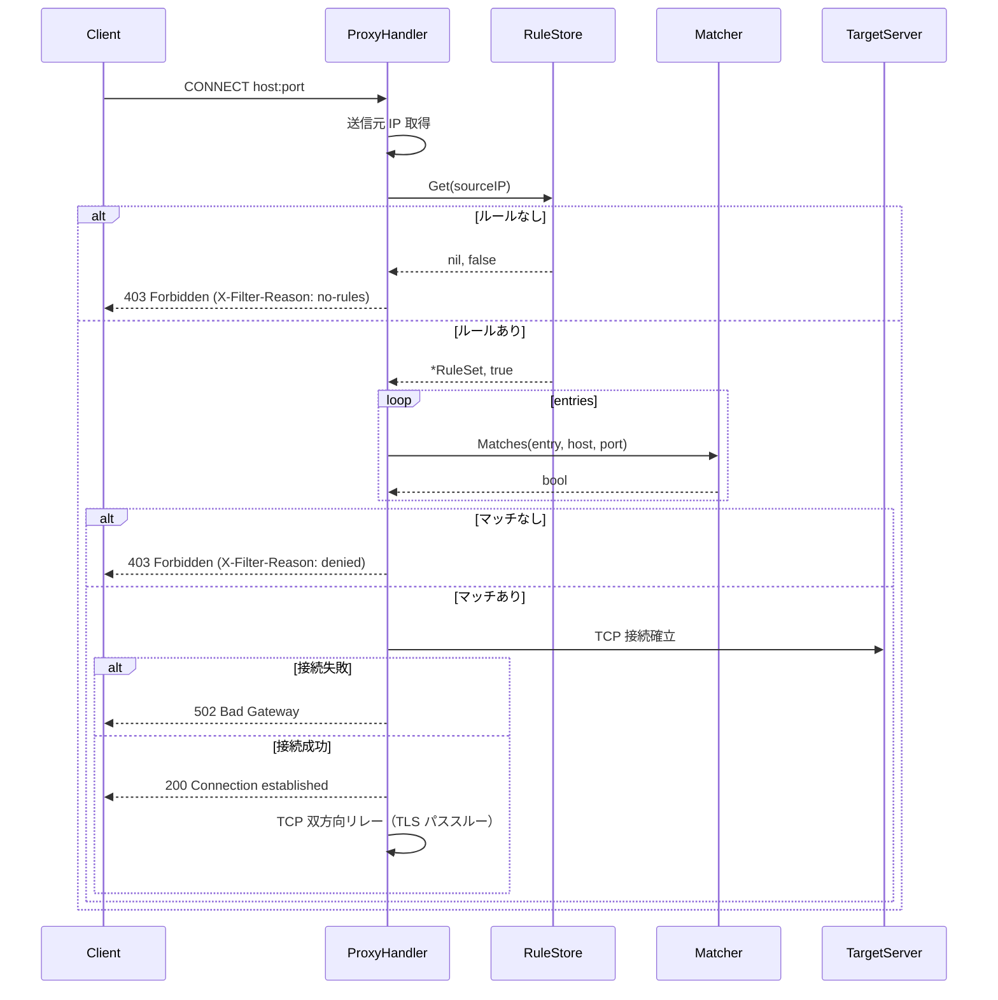

# ProxyHandler コンポーネント

## 概要

**目的**: `elazarl/goproxy` を用いて HTTP CONNECT および通常 HTTP リクエストを処理し、ルールに基づいてフィルタリングを行う

**責務**:
- `:3128` でのフォワードプロキシリッスン
- HTTP CONNECT リクエストの送信元 IP 取得
- `RuleStore` によるルールセット検索
- `Matcher` によるホスト・ポートのマッチング判定
- 許可時: TLS パススルートンネルの確立
- 拒否時: `403 Forbidden` + `X-Filter-Reason` ヘッダー返却
- アクティブ接続数のカウント管理
- 構造化ログ出力

## 明示された情報

- `elazarl/goproxy` ライブラリを使用
- TLS 終端を行わない（パススルー）
- 送信元未登録: `403` + `X-Filter-Reason: no-rules`
- ホワイトリスト不一致: `403` + `X-Filter-Reason: denied`
- 宛先への接続失敗: `502 Bad Gateway`
- 内部エラー: `500 Internal Server Error`

---

## インターフェース（Go）

### パッケージ: `internal/proxy`

```go
// Handler は goproxy をラップしたフォワードプロキシハンドラー
type Handler struct {
    store      *rule.Store
    logger     *slog.Logger
    activeConn atomic.Int64  // アクティブ接続数
}

// NewHandler は Handler を生成し、goproxy にフィルタハンドラーを登録する
func NewHandler(store *rule.Store, logger *slog.Logger) *Handler

// ServeHTTP は net/http.Handler インターフェースを実装する
func (h *Handler) ServeHTTP(w http.ResponseWriter, r *http.Request)

// ActiveConnections は現在のアクティブ接続数を返す
func (h *Handler) ActiveConnections() int64
```

---

## 接続判定フロー



---

## 送信元 IP 取得

`r.RemoteAddr` から IP 部分を抽出する（ポート部分を除く）:

```go
host, _, err := net.SplitHostPort(r.RemoteAddr)
if err != nil {
    host = r.RemoteAddr // ポート部分がない場合はそのまま使用
}
```

---

## goproxy ハンドラー登録

```go
proxy := goproxy.NewProxyHttpServer()

// CONNECT ハンドラー登録
proxy.OnRequest().HandleConnect(goproxy.FuncHttpsHandler(
    func(host string, ctx *goproxy.ProxyCtx) (*goproxy.ConnectAction, string) {
        // フィルタリング判定
        // 許可: return goproxy.OkConnect, host
        // 拒否: ctx.Resp に 403 レスポンスを設定して return goproxy.RejectConnect, host
        //   例: ctx.Resp = &http.Response{StatusCode: 403, Header: http.Header{"X-Filter-Reason": []string{"denied"}}, ...}
        //   ※ FuncHttpsHandler は http.ResponseWriter を受け取らないため直接書き込みは不可
    },
))

// 通常 HTTP ハンドラー登録（必須: US-001 の通常 HTTP フォワードプロキシ要件を満たすために必要）
proxy.OnRequest().DoFunc(
    func(r *http.Request, ctx *goproxy.ProxyCtx) (*http.Request, *http.Response) {
        // フィルタリング判定
    },
)
```

---

## エラー処理

| エラー種別 | 発生条件 | HTTPレスポンス | X-Filter-Reason |
|-----------|---------|--------------|----------------|
| 送信元未登録 | Get() が false | 403 | `no-rules` |
| ホワイトリスト不一致 | Matches() が全 false | 403 | `denied` |
| 宛先接続失敗 | TCP ダイヤル失敗 | 502 | - |
| 内部エラー | パニック・予期せぬエラー | 500 | - |

---

## テスト観点

- [ ] 正常系: 登録済み IP から許可ドメインへの CONNECT → 200 でトンネル確立
- [ ] 異常系: 未登録 IP からの CONNECT → 403 + `X-Filter-Reason: no-rules`
- [ ] 異常系: 登録済み IP から未許可ドメインへの CONNECT → 403 + `X-Filter-Reason: denied`
- [ ] 異常系: 宛先へ接続できない → 502
- [ ] 正常系: 通常 HTTP GET も同様のフィルタリングを通過する

## 関連要件

- [US-001](../../requirements/stories/US-001.md) @../../requirements/stories/US-001.md: HTTPS フォワードプロキシ
- [US-002](../../requirements/stories/US-002.md) @../../requirements/stories/US-002.md: ホワイトリスト制御
- [US-003](../../requirements/stories/US-003.md) @../../requirements/stories/US-003.md: 送信元 IP 識別
- [US-006](../../requirements/stories/US-006.md) @../../requirements/stories/US-006.md: ログ出力
