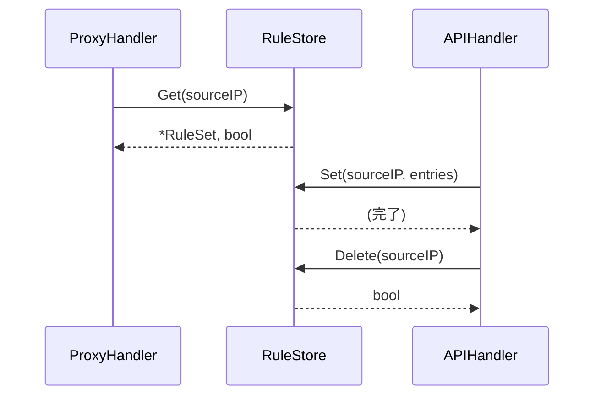

# RuleStore コンポーネント

## 概要

**目的**: 送信元 IP ごとのホワイトリストルールセットをメモリ上で管理し、スレッドセーフな読み書きを提供する

**責務**:
- ルールセットのメモリ内 CRUD 操作
- 送信元 IP によるルールセット検索
- 並行アクセスに対するスレッドセーフ保証
- ルール変更時のログ出力

## 明示された情報

- ルールはメモリ上に保持（永続化不要）
- `sync.RWMutex` で並行アクセスを制御
- `go test -race` で競合検出すること

---

## インターフェース（Go）

### パッケージ: `internal/rule`

```go
// Entry は1つの許可ルールエントリ
type Entry struct {
    Host string  // ドメイン、ワイルドカード、IP、CIDR
    Port int     // 0 = 全ポート許可
}

// RuleSet は送信元 IP 1つ分のルールセット
type RuleSet struct {
    Entries   []Entry
    UpdatedAt time.Time
}

// Store はルールセットのインメモリストア
type Store struct {
    mu    sync.RWMutex
    rules map[string]*RuleSet // key: 送信元 IP
}
```

### 公開メソッド

#### `NewStore() *Store`
空のルールストアを生成する。

#### `Get(sourceIP string) (*RuleSet, bool)`
指定した送信元 IP のルールセットを返す。存在しない場合は `(nil, false)`。
読み取り時は `RLock()` を使用する。

#### `Set(sourceIP string, entries []Entry)`
指定した送信元 IP のルールセットを全置換する（存在しない場合は新規作成）。
書き込み時は `Lock()` を使用する。

#### `Delete(sourceIP string) bool`
指定した送信元 IP のルールセットを削除する。存在した場合 `true` を返す。

#### `DeleteAll()`
全ルールセットを削除する。

#### `All() map[string]*RuleSet`
全ルールセットのスナップショットコピーを返す（呼び出し元が変更しても元マップに影響しない）。

#### `Count() int`
登録済みルールセット数を返す。

---

## データ構造詳細

```go
// ルールセットのメモリレイアウト
rules: {
    "172.20.0.3": &RuleSet{
        Entries: []Entry{
            {Host: "api.anthropic.com", Port: 443},
            {Host: "*.npmjs.org",       Port: 443},
        },
        UpdatedAt: time.Time{...},
    },
    "172.20.0.4": &RuleSet{
        Entries: []Entry{
            {Host: "api.anthropic.com", Port: 443},
            {Host: "*.github.com",      Port: 443},
            {Host: "140.82.112.0/20",   Port: 443},
        },
        UpdatedAt: time.Time{...},
    },
}
```

---

## 依存関係

### 依存するコンポーネント
- なし（標準ライブラリのみ）

### 依存されるコンポーネント
- [proxy-handler](proxy-handler.md) @proxy-handler.md: ルール参照（読み取り）
- [api-handler](api-handler.md) @api-handler.md: ルール変更（読み書き）

---

## データフロー



---

## エラー処理

| エラー種別 | 発生条件 | 対処方法 |
|-----------|---------|---------|
| IP 未登録 | `Get()` で存在しない IP を指定 | `(nil, false)` を返す。呼び出し元が 403 判定を行う |

---

## テスト観点

- [ ] 正常系: `Set` → `Get` でルールセットが取得できる
- [ ] 正常系: `Set` → `Delete` → `Get` で `(nil, false)` になる
- [ ] 正常系: `DeleteAll` で全ルールが消える
- [ ] 正常系: `All()` が返すマップを変更しても元ストアに影響しない
- [ ] 境界値: 空の `entries` を `Set` した場合にパニックしない
- [ ] 並行性: `go test -race` で `Get` と `Set` の同時実行が競合しない

## 関連要件

- [US-003](../../requirements/stories/US-003.md) @../../requirements/stories/US-003.md: 送信元 IP ベースのルール識別
- [NFR-SEC-005](../../requirements/nfr/security.md) @../../requirements/nfr/security.md: 並行アクセスの安全性
