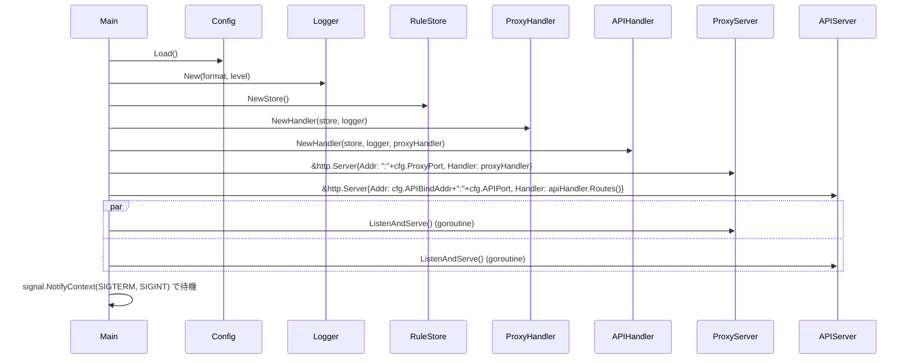
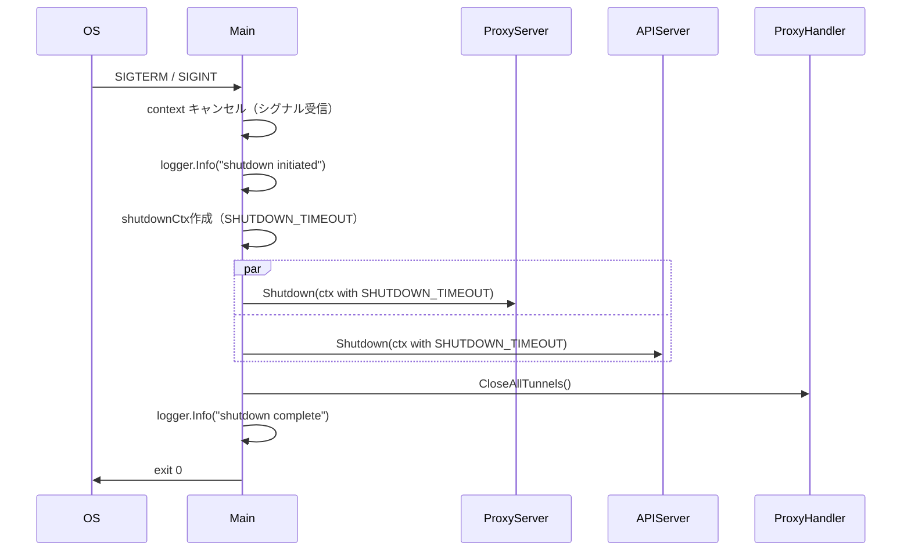

# Server コンポーネント（main / エントリポイント）

## 概要

**目的**: アプリケーション全体のライフサイクルを管理する。プロキシサーバーと API サーバーの起動・Graceful Shutdown を制御する

**責務**:
- 環境変数から設定値を読み込む
- 各コンポーネントの依存注入（DI）
- プロキシサーバー（:3128）と API サーバー（:8080）の並行起動
- SIGTERM / SIGINT の受信と Graceful Shutdown の実行
- 両サーバーの `Server.Shutdown()` を `SHUTDOWN_TIMEOUT` 秒以内に完了

---

## インターフェース（Go）

### パッケージ: `internal/config` と `cmd/filter-proxy/main.go`

```go
// Config は環境変数から読み込む設定
type Config struct {
    ProxyPort       string        // PROXY_PORT (default: "3128")
    APIPort         string        // API_PORT   (default: "8080")
    APIBindAddr     string        // API_BIND_ADDR (default: "127.0.0.1")
    LogLevel        string        // LOG_LEVEL  (default: "info")
    LogFormat       string        // LOG_FORMAT (default: "json")
    ShutdownTimeout time.Duration // SHUTDOWN_TIMEOUT 秒 (default: 30s)
}

// Load は環境変数から Config を読み込む
// API_BIND_ADDR が不正な IP アドレスの場合は "127.0.0.1" にフォールバック
func Load() Config
```

---

## 起動フロー



---

## Graceful Shutdown フロー



---

## ディレクトリ構成（パッケージ設計）

```text
filter-proxy/
├── cmd/
│   └── filter-proxy/
│       └── main.go           # エントリポイント
├── internal/
│   ├── config/
│   │   └── config.go         # 環境変数設定読み込み
│   ├── rule/
│   │   ├── store.go          # RuleStore
│   │   ├── matcher.go        # Matches / ValidateEntry
│   │   └── store_test.go
│   │   └── matcher_test.go
│   ├── proxy/
│   │   ├── handler.go        # ProxyHandler (goproxy ラッパー)
│   │   └── handler_test.go
│   ├── api/
│   │   ├── handler.go        # APIHandler
│   │   └── handler_test.go
│   └── logger/
│       └── logger.go         # Logger ファクトリ
├── Dockerfile
├── docker-compose.yml        # 開発用
├── go.mod
└── go.sum
```

---

## 環境変数一覧

| 変数名 | デフォルト | 型 | 説明 |
|--------|-----------|-----|------|
| `PROXY_PORT` | `3128` | string | プロキシリッスンポート |
| `API_PORT` | `8080` | string | API リッスンポート |
| `API_BIND_ADDR` | `127.0.0.1` | string | API バインドアドレス（不正値は `127.0.0.1` にフォールバック） |
| `LOG_LEVEL` | `info` | string | `debug`/`info`/`warn`/`error` |
| `LOG_FORMAT` | `json` | string | `json`/`text` |
| `SHUTDOWN_TIMEOUT` | `30` | int (秒) | Graceful shutdown 待機時間 |

---

## テスト観点

- [ ] 正常系: SIGTERM 受信後に両サーバーが正常終了する
- [ ] 正常系: SHUTDOWN_TIMEOUT 秒以内に強制終了する
- [ ] 正常系: 環境変数未設定時にデフォルト値が使用される
- [ ] 正常系: シャットダウン時にアクティブな CONNECT トンネルが正常にクローズされる
- [ ] 正常系: トンネル接続数のトラッキングが正確に動作する（trackConn/untrackConn）
- [ ] 異常系: SHUTDOWN_TIMEOUT 内にトンネルクローズが完了する
- [ ] 正常系: `API_BIND_ADDR=0.0.0.0` で全インターフェースにバインドされる
- [ ] 正常系: `API_BIND_ADDR` 未設定時に `127.0.0.1` にバインドされる
- [ ] 異常系: `API_BIND_ADDR` に不正値を設定した場合 `127.0.0.1` にフォールバックする
- [ ] 正常系: `healthcheck` サブコマンドで API が 200 を返す場合に終了コード 0
- [ ] 異常系: `healthcheck` サブコマンドで API が応答しない場合に終了コード 1

## CONNECT トンネルのトラッキングとシャットダウン

`net/http` の `Server.Shutdown()` は hijacked connections（HTTP CONNECT で確立された TCP トンネル）を閉じない。
シャットダウン時にアクティブな CONNECT トンネルを確実に回収するために、以下の設計を採用する。

### トンネルトラッキング設計

ProxyHandler は `trackingConn` でトンネル接続をラップし、接続のライフサイクルを管理する。
Shutdown 時には ProxyHandler の `CloseAllTunnels()` を呼び出してアクティブなトンネルを強制クローズする。

```go
// ProxyHandler に CloseAllTunnels() を追加
type Handler struct {
    store      *rule.Store
    logger     *slog.Logger
    activeConn atomic.Int64
    proxy      *goproxy.ProxyHttpServer
    mu         sync.Mutex
    tunnels    []net.Conn // アクティブなトンネル接続のリスト
}

// trackingConn はトンネル接続をラップし、Close 時に自動で登録解除する
type trackingConn struct {
    net.Conn
    handler *Handler
    once    sync.Once
}

func (tc *trackingConn) Close() error {
    tc.once.Do(func() {
        tc.handler.untrackConn(tc)
    })
    return tc.Conn.Close()
}

// trackConn はトンネル接続を登録する（CONNECT 成功時に呼び出す）
func (h *Handler) trackConn(conn net.Conn) *trackingConn {
    tc := &trackingConn{Conn: conn, handler: h}
    h.mu.Lock()
    h.tunnels = append(h.tunnels, tc)
    h.mu.Unlock()
    return tc
}

// untrackConn はトンネル接続を登録解除する（接続クローズ時に呼び出される）
func (h *Handler) untrackConn(tc *trackingConn) {
    h.mu.Lock()
    defer h.mu.Unlock()
    for i, c := range h.tunnels {
        if c == tc {
            h.tunnels = append(h.tunnels[:i], h.tunnels[i+1:]...)
            break
        }
    }
}

// CloseAllTunnels はアクティブな全トンネル接続を強制クローズする
// Graceful Shutdown 時に呼び出す
func (h *Handler) CloseAllTunnels() {
    h.mu.Lock()
    defer h.mu.Unlock()
    for _, c := range h.tunnels {
        _ = c.Close()
    }
    h.tunnels = nil
}
```

### Graceful Shutdown フローへの統合

```go
// main.go の Shutdown 処理に CloseAllTunnels を追加
log.Info("shutdown initiated")
shutdownCtx, cancel := context.WithTimeout(context.Background(), cfg.ShutdownTimeout)
defer cancel()

// 1. まず新規受付を停止
var wg sync.WaitGroup
for _, srv := range []*http.Server{proxySrv, apiSrv} {
    wg.Add(1)
    go func(s *http.Server) {
        defer wg.Done()
        _ = s.Shutdown(shutdownCtx)
    }(srv)
}
wg.Wait()

// 2. Server.Shutdown() 完了後、残存 CONNECT トンネルを強制クローズ
proxyHandler.CloseAllTunnels()
log.Info("shutdown complete")
```

## ヘルスチェックサブコマンド

`main()` でコマンドライン引数を確認し、`healthcheck` が指定された場合はプロキシモードに入らずヘルスチェックを実行して終了する。

```go
func main() {
    if len(os.Args) > 1 && os.Args[1] == "healthcheck" {
        os.Exit(runHealthcheck())
    }
    os.Exit(run())
}

// healthcheckAddr はヘルスチェック対象アドレスを解決する。
// ワイルドカード(0.0.0.0, ::)とデフォルト(127.0.0.1)は 127.0.0.1 に解決し、
// 特定アドレス(172.20.0.2, ::1 等)はそのまま使用する。
func healthcheckAddr() string {
    port := os.Getenv("API_PORT")
    if port == "" {
        port = "8080"
    }
    host := os.Getenv("API_BIND_ADDR")
    switch host {
    case "", "127.0.0.1", "0.0.0.0", "::":
        host = "127.0.0.1"
    }
    return net.JoinHostPort(host, port)
}

func runHealthcheck() int {
    addr := healthcheckAddr()
    client := &http.Client{Timeout: 5 * time.Second}
    resp, err := client.Get("http://" + addr + "/api/v1/health")
    if err != nil {
        return 1
    }
    defer func() { _ = resp.Body.Close() }()
    if resp.StatusCode == http.StatusOK {
        return 0
    }
    return 1
}
```

### 設計ポイント

- ヘルスチェックのアドレス解決: ワイルドカード（`0.0.0.0`, `::`）およびデフォルト（`127.0.0.1`）の場合は `127.0.0.1` に接続する。特定アドレス（`172.20.0.2`, `::1` 等）の場合はそのアドレスに直接接続する
- `API_PORT` 環境変数を参照してポートを決定する（`config.Load()` は使わず軽量に取得）
- タイムアウトは 5 秒（Dockerfile の `--timeout=5s` と一致）
- ログ初期化やコンポーネント生成は一切行わない

---

## 注意事項

- `net/http` の `Server.Shutdown()` は hijacked connections（HTTP CONNECT で確立された TCP トンネル）を閉じない。上記のトンネルトラッキング設計を実装してシャットダウン時に `CloseAllTunnels()` を呼び出すこと
- `SHUTDOWN_TIMEOUT` は `Server.Shutdown()` の待機時間を制御する。トンネルのクローズは `Server.Shutdown()` 完了後に同期的に行う

## 関連要件

- [US-007](../../requirements/stories/US-007.md) @../../requirements/stories/US-007.md: Graceful Shutdown
- [US-008](../../requirements/stories/US-008.md) @../../requirements/stories/US-008.md: Management API バインドアドレス設定
- [US-009](../../requirements/stories/US-009.md) @../../requirements/stories/US-009.md: ヘルスチェックサブコマンド
- [NFR-MNT-004](../../requirements/nfr/maintainability.md) @../../requirements/nfr/maintainability.md: Graceful shutdown の確実性
