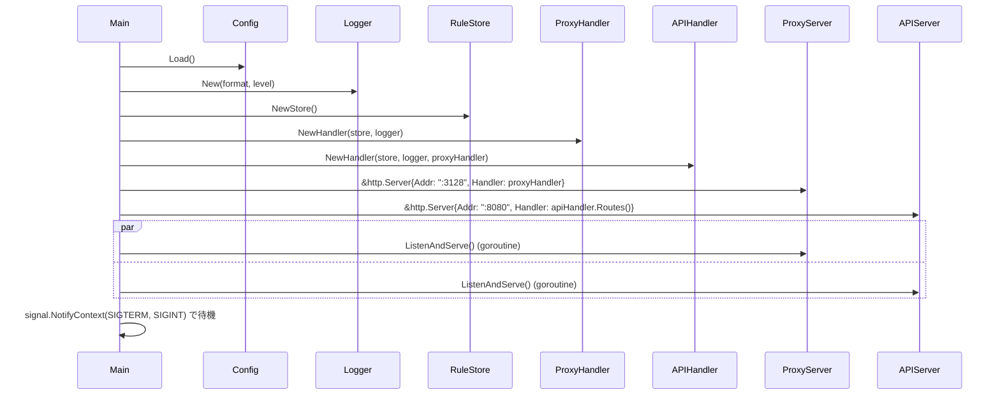
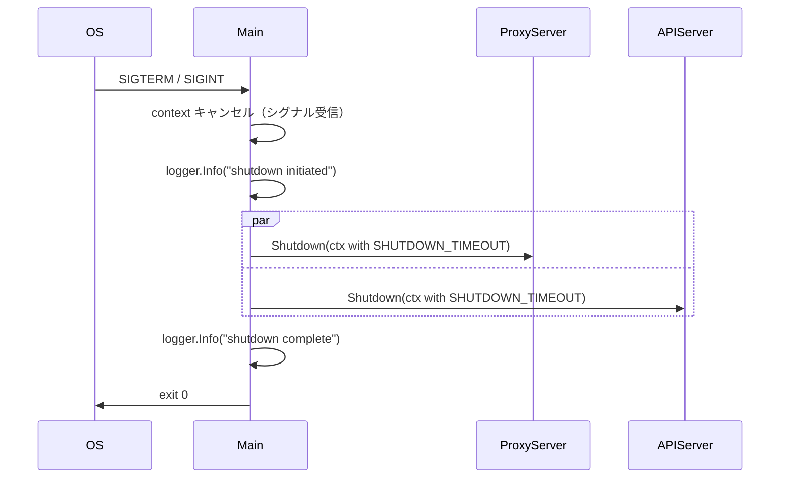

# Server コンポーネント（main / エントリポイント）

## 概要

**目的**: アプリケーション全体のライフサイクルを管理する。プロキシサーバーと API サーバーの起動・Graceful Shutdown を制御する

**責務**:
- 環境変数から設定値を読み込む
- 各コンポーネントの依存注入（DI）
- プロキシサーバー（:3128）と API サーバー（:8080）の並行起動
- SIGTERM / SIGINT の受信と Graceful Shutdown の実行
- 両サーバーの `Server.Shutdown()` を `SHUTDOWN_TIMEOUT` 秒以内に完了

---

## インターフェース（Go）

### パッケージ: `internal/config` と `cmd/filter-proxy/main.go`

```go
// Config は環境変数から読み込む設定
type Config struct {
    ProxyPort       string        // PROXY_PORT (default: "3128")
    APIPort         string        // API_PORT   (default: "8080")
    LogLevel        string        // LOG_LEVEL  (default: "info")
    LogFormat       string        // LOG_FORMAT (default: "json")
    ShutdownTimeout time.Duration // SHUTDOWN_TIMEOUT 秒 (default: 30s)
}

// Load は環境変数から Config を読み込む
func Load() Config
```

---

## 起動フロー



---

## Graceful Shutdown フロー



---

## ディレクトリ構成（パッケージ設計）

```text
filter-proxy/
├── cmd/
│   └── filter-proxy/
│       └── main.go           # エントリポイント
├── internal/
│   ├── config/
│   │   └── config.go         # 環境変数設定読み込み
│   ├── rule/
│   │   ├── store.go          # RuleStore
│   │   ├── matcher.go        # Matches / ValidateEntry
│   │   └── store_test.go
│   │   └── matcher_test.go
│   ├── proxy/
│   │   ├── handler.go        # ProxyHandler (goproxy ラッパー)
│   │   └── handler_test.go
│   ├── api/
│   │   ├── handler.go        # APIHandler
│   │   └── handler_test.go
│   └── logger/
│       └── logger.go         # Logger ファクトリ
├── Dockerfile
├── docker-compose.yml        # 開発用
├── go.mod
└── go.sum
```

---

## 環境変数一覧

| 変数名 | デフォルト | 型 | 説明 |
|--------|-----------|-----|------|
| `PROXY_PORT` | `3128` | string | プロキシリッスンポート |
| `API_PORT` | `8080` | string | API リッスンポート |
| `LOG_LEVEL` | `info` | string | `debug`/`info`/`warn`/`error` |
| `LOG_FORMAT` | `json` | string | `json`/`text` |
| `SHUTDOWN_TIMEOUT` | `30` | int (秒) | Graceful shutdown 待機時間 |

---

## テスト観点

- [ ] 正常系: SIGTERM 受信後に両サーバーが正常終了する
- [ ] 正常系: SHUTDOWN_TIMEOUT 秒以内に強制終了する
- [ ] 正常系: 環境変数未設定時にデフォルト値が使用される

## 関連要件

- [US-007](../../requirements/stories/US-007.md) @../../requirements/stories/US-007.md: Graceful Shutdown
- [NFR-MNT-004](../../requirements/nfr/maintainability.md) @../../requirements/nfr/maintainability.md: Graceful shutdown の確実性
